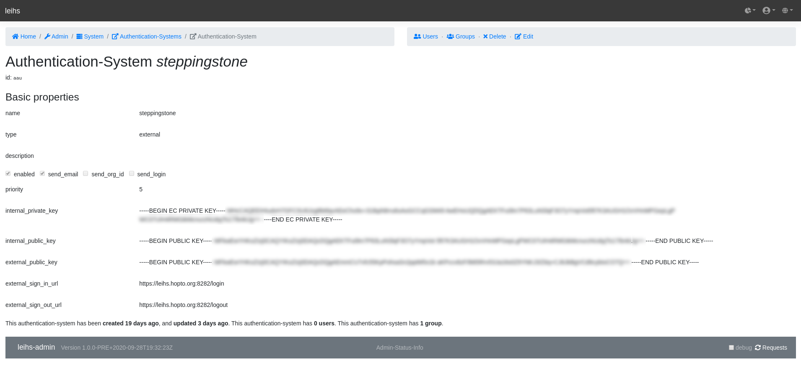

# Steppingstone
Leihs authentication server using CAS

## build

Build with docker:
```
$ docker run --rm -v "$PWD":/usr/src/myapp -w /usr/src/myapp golang:1.14 go build -v
```
First run will create a config file at the specified path.

example `conf.yml`
```
leihsurl: https://leihs.hopto.org/
casurl: https://signon.aau.dk/cas/
server_addr: :8282
external_private_key_path: ./keys/external_key_pair.pem
internal_public_key_path: ./keys/internal_public_key.pem
https_cert_path: /etc/letsencrypt/live/{{.LeihsUrl}}/cert.pem
https_key_path: /etc/letsencrypt/live/{{.LeihsUrl}}/privkey.pem
```



### Caveat
Under "Basic properties" type = "external".
"external" is keyword

[Leihs external authentication wiki]https://github.com/leihs/leihs/wiki/external_authentication

